# OC Sessions - OpenCode 会话管理应用

一个用于管理和浏览 OpenCode 会话记录的 Web 应用。

## 功能特性

- **会话列表管理** - 查看、搜索、删除、重命名会话
- **主子会话关联** - subagents会话显示在主会话下一层级
- **批量操作** - 多选会话进行批量删除
- **消息详情** - 查看完整会话内容，支持 Markdown 渲染
- **思考过程展示** - 显示 AI 的思考过程（reasoning）
- **代码差异对比** - 显示代码变更的 diff 视图
- **消息导航** - 快速跳转到指定消息
- **项目分组** - 按项目组织会话，Global项目按目录分组
- **设置页面** - 查看和配置数据库路径

## 效果图

会话消息展示（子agent会话关联显示在主会话下一层级）

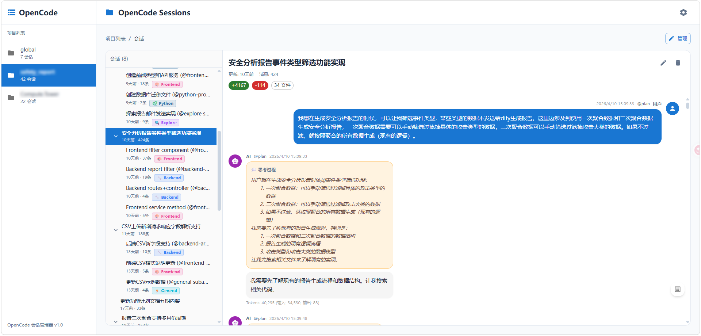

subagent标识

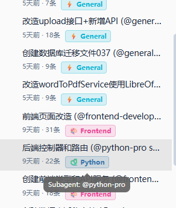

Markdown 语法渲染

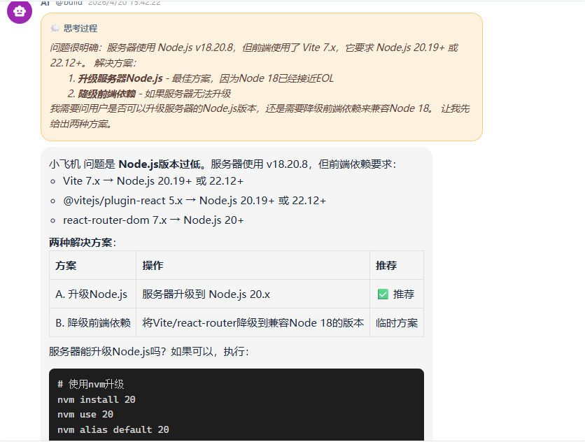

文件代码差异

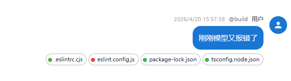
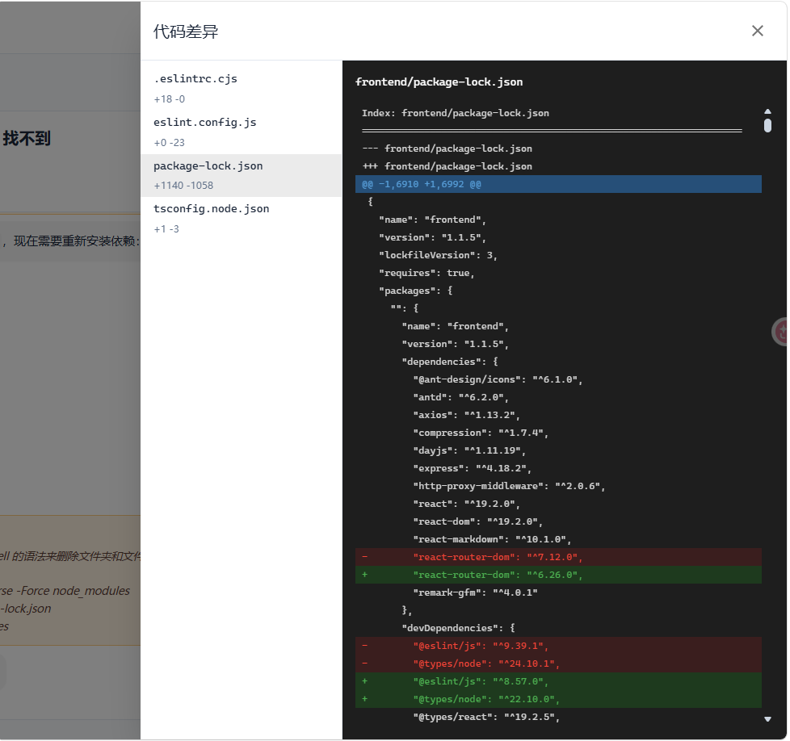

会话删除（可关联删除子会话，也可单独删除主会话）

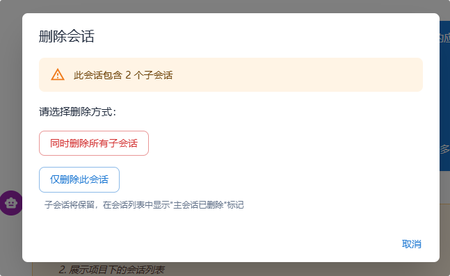
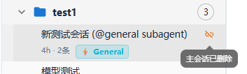

重命名会话

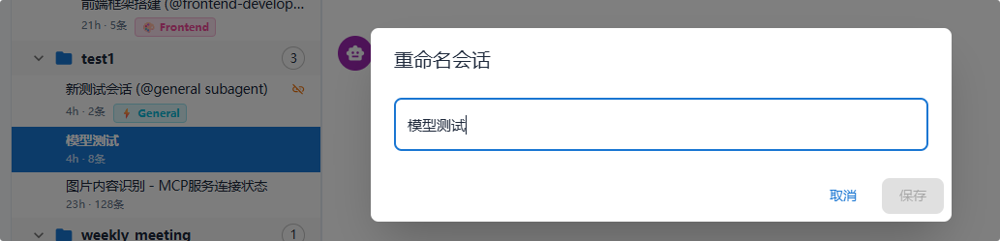

批量删除会话

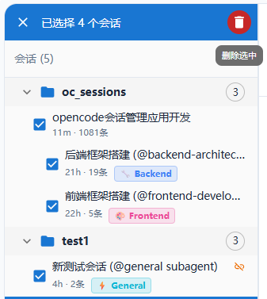

消息跳转

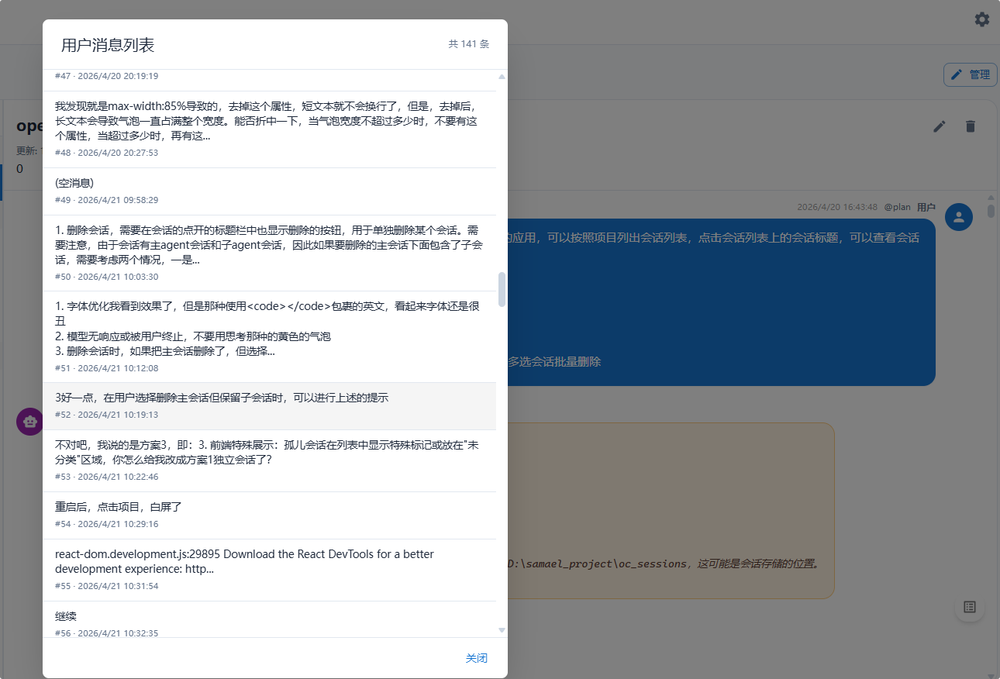

opencode数据库位置配置

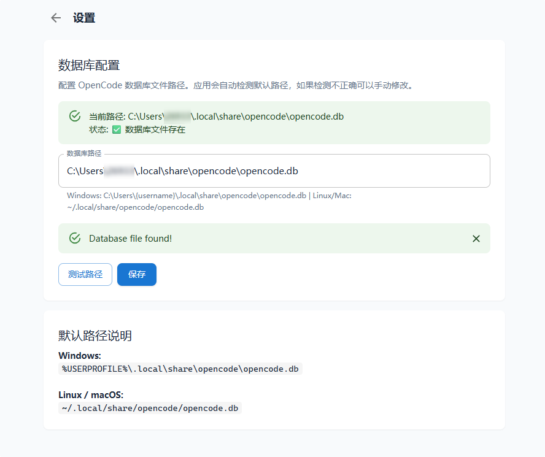

## 技术栈

### 前端
- React 18 + TypeScript
- Material UI (MUI)
- React Router
- React Query (TanStack Query)
- React Markdown
- Zustand (状态管理)
- Vite

### 后端
- Node.js + Express
- Better SQLite3
- WebSocket (ws)

## 项目结构

```
oc_sessions/
├── frontend/          # 前端应用
│   ├── src/
│   │   ├── components/  # React 组件
│   │   ├── pages/       # 页面组件
│   │   ├── hooks/       # 自定义 Hooks
│   │   ├── services/    # API 服务
│   │   ├── stores/      # Zustand 状态
│   │   └── types/       # TypeScript 类型
│   └── package.json
├── backend/           # 后端服务
│   ├── src/
│   │   ├── routes/      # API 路由
│   │   ├── services/    # 业务逻辑
│   │   └── types/       # TypeScript 类型
│   └── package.json
└── docs/              # 文档和截图
```

## 快速开始

### 环境要求
- Node.js >= 18
- npm 或 pnpm

### 安装依赖

```bash
# 安装后端依赖
cd backend
npm install

# 安装前端依赖
cd ../frontend
npm install
```

### 配置

复制环境变量配置文件：

```bash
# 后端配置
cp backend/.env.example backend/.env

# 前端配置
cp frontend/.env.example frontend/.env
```

配置文件说明：

**backend/.env**
```bash
PORT=9001                    # 后端端口
DB_PATH=                     # 数据库路径（留空自动检测：~/.local/share/opencode/opencode.db）
DIFF_STORAGE_PATH=           # 差异文件存储路径（留空自动检测：~/.local/share/opencode/storage/session_diff）
```

**frontend/.env**
```bash
VITE_PORT=9000               # 前端端口
VITE_API_BASE=http://localhost:9001/api  # 后端API地址（生产环境可改为 /api）
```

### 启动开发服务器

```bash
# 启动后端 (在 backend 目录)
npm run dev

# 启动前端 (在 frontend 目录)
npm run dev
```

后端服务运行在 `http://localhost:9001`，前端运行在 `http://localhost:9000`。

### 构建生产版本

```bash
# 构建后端
cd backend
npm run build
npm start

# 构建前端
cd ../frontend
npm run build
```

## 数据库

应用直接读取 OpenCode 的数据库文件。系统会自动检测默认路径：

- **Windows**: `%USERPROFILE%\.local\share\opencode\opencode.db`
- **Linux/macOS**: `~/.local/share/opencode/opencode.db`

### 手动配置

如果自动检测不正确，可以在应用的**设置页面**手动配置数据库路径。

也可以通过环境变量指定：
```bash
DB_PATH=/path/to/opencode.db
```

## API 接口

### 项目相关
- `GET /api/projects` - 获取项目列表
- `GET /api/projects/:id` - 获取单个项目
- `GET /api/projects/stats/overview` - 获取项目统计

### 会话相关
- `GET /api/sessions/project/:projectId` - 获取项目下的会话树
- `GET /api/sessions/:id` - 获取会话详情
- `GET /api/sessions/:id/messages` - 获取会话消息
- `GET /api/sessions/:id/diff` - 获取代码差异
- `GET /api/sessions/:id/children` - 获取子会话
- `GET /api/sessions/:id/tree` - 获取会话树
- `GET /api/sessions/:id/stats` - 获取会话统计
- `PUT /api/sessions/:id` - 更新会话标题
- `DELETE /api/sessions/:id` - 删除会话

### 配置相关
- `GET /api/config/database` - 获取数据库配置
- `POST /api/config/database/test` - 测试数据库路径
- `PUT /api/config/database` - 更新数据库路径

## WebSocket

后端通过 WebSocket 推送实时更新：
- 会话创建/更新/删除事件
- 消息新增事件

## 许可证

MIT License
